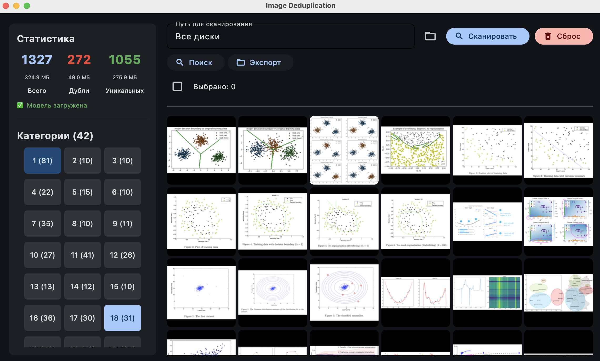

# Image Deduplication

Deduplication, clustering, and semantic search for images.

**🌐 Language:** [English](README.en.md) · [Русский](README.md)

## Screenshot



## Core Idea

A single local tool for managing your image library that combines three tasks in one application:

- **Deduplication** — finds exact and visually similar duplicates using perceptual hashing (pHash + LSH), not just identical files.
- **Semantic search** — finds images by natural-language descriptions (SigLIP 2 + FAISS), not just by filename.
- **Auto-clustering** — groups similar images (HDBSCAN + UMAP) to help you organize large collections.

Everything runs locally (no data uploaded to the cloud) and incrementally (only what changed is recomputed). It doesn't require a powerful GPU: where a GPU is available, acceleration is used (CUDA on NVIDIA, MPS on Apple Silicon), otherwise CPU. Both a Flet desktop UI and a CLI are available.

## Features

- Incremental directory scanning
- Deduplication via perceptual hash (pHash + LSH)
- Semantic text search (SigLIP 2 + FAISS)
- Clustering (HDBSCAN + UMAP)
- Desktop UI built with Flet

## Requirements

- Python 3.12 (recommended)
- pip

## Installation

### Automatic install (recommended)

The easiest way is to run the automatic install script:

**macOS / Linux:**
```bash
chmod +x install_and_run.command
./install_and_run.command
```

The script will install Xcode Command Line Tools, Homebrew, Python 3.12, the virtual environment, dependencies, and download the SigLIP model.

**Windows:**
```bat
install_and_run.bat
```

The script will install Python 3.12, the Visual C++ Redistributable, the virtual environment, dependencies, and download the SigLIP model.

### Manual install

If the automatic install isn't suitable:

```bash
python -m venv .venv
.venv\Scripts\activate.bat   # Windows (cmd.exe or PowerShell)
source .venv/bin/activate     # macOS / Linux

pip install -r requirements.txt
```

Download the SigLIP model (required for `ui-flet`, `embed`, `search`):

```bash
python -c "from transformers import AutoProcessor, AutoModel; m='google/siglip-base-patch16-224'; AutoProcessor.from_pretrained(m); AutoModel.from_pretrained(m); print('Model loaded:', m)"
```

### macOS

On Apple Silicon (`arm64`) PyTorch automatically uses MPS. On Intel (`x86_64`) it uses CPU.

Python 3.12 from python.org or Homebrew is recommended:

```bash
brew install python@3.12
```

### Windows

Python 3.12 from [python.org](https://www.python.org/downloads/windows/) or winget is recommended:

```bash
winget install Python.Python.3.12
```

Visual C++ Redistributable may be required for Flet desktop mode.

> **Note:** to activate the venv always use `activate.bat` (not `Activate.ps1`),
> or enable PowerShell scripts: `Set-ExecutionPolicy -ExecutionPolicy RemoteSigned -Scope CurrentUser`.

## Usage

### Desktop UI

```bash
python main.py ui-flet
```

The UI (see the screenshot above) is available after installing dependencies and loading the SigLIP model.

### CLI

```bash
# Scan a directory
python main.py scan --path "/path/to/folder"

# Full recompute (instead of incremental)
python main.py scan --path "/path/to/folder" --full

# Scan with extension filter and exclusions
python main.py scan --path "/path/to/folder" --ext "jpg,png,webp" --exclude "tmp,cache"

# Deduplication
python main.py dedup

# Deduplication with moving duplicates
python main.py dedup --move "/path/to/duplicates"

# Scan + deduplication in one pass
python main.py run --path "/path/to/folder"

# Clear the database
python main.py clear

# Embeddings (requires PyTorch)
python main.py embed

# Clustering
python main.py cluster-hdb

# Semantic search (requires PyTorch)
python main.py search "cat on the windowsill"

# Semantic search with a custom result count
python main.py search "cat on the windowsill" --top-k 10

# Search for similar images by pHash
python main.py phash-search "/path/to/image.jpg"

# Search for similar images by pHash with a custom result count
python main.py phash-search "/path/to/image.jpg" --top-k 10
```

## Notes

- The `scan`, `dedup`, `run`, `clear`, and `cluster-hdb` commands work **without PyTorch**.
- The `embed`, `search`, and `phash-search` commands require an installed `torch`.
- Incremental mode is used by default. Add `--full` for a full recompute.
- MPS is used automatically on Apple Silicon, CUDA on NVIDIA, CPU otherwise.
- The default minimum file size is 10 KB. Use `--min-size` to change it.